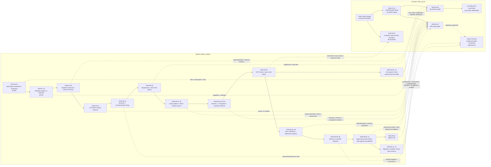

# OpenAI × YamRail 独立収束時系列記録 2026-09-13

## 0. 文書目的

本書は、2026-08〜2026-09に継続して行ったOpenAI公式発表・公式ドキュメント・`openai/codex`公式実装・OpenAI公式特許方針・OpenAI名義公開特許の観測記録を、YamRail側の既存設計要素と時系列で並べ直した開発史記録である。

目的は「OpenAIがYamRailを参照した」または「YamRailがOpenAIを参照した」と断定することではない。

本書では以下を分離する。

- **時系列上確認できる先行例**
- **後から構造的に近接した実装・運用**
- **YamRail側で独立に成立していた設計要素**
- **構造的一致**
- **因果関係・学習利用**

因果関係または学習利用を直接示す証拠がないものは **UNKNOWN** とする。

---

## 1. 判定ルール

### 1.1 構造的一致として採用する条件

単なる用語一致ではなく、少なくとも以下のいずれかが実際の状態遷移・権限判定・施工工程として確認できる場合に採用する。

- 能力とAuthority / permissionが別判定
- 人間確認前後で施工状態が変わる
- 不明・不適合時に安全側へ停止する
- 親子Agent、施工者／検収者、施工者／観測者を別区画として扱う
- 作業票／call ID／turn ID等へ出来形・承認・返却を拘束する
- Compaction / resume / forkを越えて状態・証憑・Authorityを別管理する
- RAG / Memory / Connectorを対話本体から外出しする
- 施工条件変更時に旧判定・旧承認・旧資格を失効させる
- 施工中・未着手・検収待ち・read-only等を別状態として扱う

### 1.2 本書で因果線を引かない条件

- 公開時期が近いだけ
- 同じ用語を使っているだけ
- AI Agent一般で自然に必要になる構造
- 公開情報に相互参照がない

これらは **独立収束候補** とし、因果線は引かない。

---

## 2. YamRail側の確定基面

### YR-0: 初期YAML思想

初期YAML思想では、目的・制約・完了条件・未完了事項・状態をAI Worker個体や会話画面へ閉じ込めず、外部化して別Workerへ搬送可能にする発想が成立していた。

2026-08-24の開発史記録では、この思想をAI Worker間の状態搬送、ツール非依存化、施工状態保持の基礎として整理した。

関連記録:

- `docs/history/AI_WORKER_STATE_TRANSFER_BOUNDARY_20260824.md`

### YR-1: YamRail出願

- 特願2026-175840
- 出願日: **2026-07-22**

本書では法的な権利範囲を独自評価しない。公開先行例との関係は弁理士照査事項とする。

### YR-2: EEA / φLLM 公開

2026-08-19、jXivで以下2報が公開された。

- jXiv 6109: **「証拠・境界制約下におけるLLM挙動」**
- jXiv 6112: **「φLLM / AI Worker 技術報告書」**

Repository正本: `PUBLICATIONS.md`

EEA側では、責任 → 介入点 → 境界・権限・証跡 → 受入検査、という設計順序を明示している。

φLLM側では、単一性能指標へ潰さず、運用作業挙動を多次元で測定し、境界条件付きで施工者適合性を扱う。

### YR-3: φLLM出願

φLLMは**出願済み**であることを2026-08-21時点で確認済み。

- 正確な出願日: **本開発史棚では未固定 / UNKNOWN**
- 本書ではYamRail本体の特願2026-175840と混同しない。

### YR-4: 図書館要塞

証憑束はYamRail本体またはφLLMそのものではなく、**図書館要塞の構成要素**として扱う。

したがってOpenAIのMemory / RAG / Compaction / File Search特許等との比較では、

- YamRail本体
- φLLM
- 図書館要塞

を混同しない。

---

## 3. OpenAI側の時系列節点

以下は細かなPRをすべて列挙せず、構造が成立した主要節点へ束ねた。

### OA-0: 2024-06-07 — Multi-Agent coordinator / filtered workspace / trace系の先行特許基面

OpenAI OpCo系の `US12405822B1 / WO2025254945A1` では、coordinator agent、task agent、workspace、filtered workspace view、channel access、append-only ledger、trace / review service等が開示されている。

- 最早確認優先日: **2024-06-07**
- 米国公開・登録: 2025-09-02
- PCT公開: 2025-12-11

**YamRailとの対応:**

- 役割分離
- coordinator / Worker分工
- 作業区画
- 追記型台帳
- 行動trace
- review

**重要:** これはYamRail成立より前の先行例であり、multi-agent coordinator、区画分離、trace等をYamRail固有発明として扱う根拠にはならない。

因果関係: **UNKNOWN**

### OA-1: 2025-01〜2026-07 — 代理施工要求とAuthority tokenの分離

`Language model acting as user's delegate for automations and other applications` 系では、ユーザーからの代理施工要求と、代理施工してよいことを示す認証・authorization indicatorを別要素として扱う。

- 最早確認優先日: **2025-01-14**
- 継続出願公開: **2026-07-16**

**YamRailとの対応:**

- Capability / requested action ≠ Authority
- 長期施工再開時の権限再接続
- user interventionが必要な前提条件での差戻し

**差分:** YamRailのHOLD/UNKNOWN、施工者資格判定、受入検査体系までは含まない。

### OA-2: 2025-02-25 — Stateful transformer / state reachability / external memory

`Stateful pretrained transformers in a generative response engine` 系では、stateごとのinstructions、到達可能state制約、外部key-value memory、context window外の状態保持が開示される。

- 確認出願日・優先基面: **2025-02-25**
- 先行米国特許公開: 2025-08-26
- continuation公開: 2026-08-27
- PCT公開: 2026-09-03

**YamRailとの対応:**

- 状態分離
- 状態遷移
- context外の長期状態
- 必要状態のみ施工面へ搬入

**差分:** Human Gate / Authority / HOLD / UNKNOWNの一般状態機械ではない。

### OA-3: 2025-03-10 — 別LLMによるCoT / action監視

OpenAI公式研究で、主AgentのCoT・中間action・最終出力を別LLMで監視する構造が公開される。

後に2026-09-10公開のOpenAI名義出願 `US20260268155A1` 等で、監視モデルが異常を検出した場合に主モデル出力をrejectし、同じユーザーtaskを再投入して追加iterationを行う構造が請求項化された。

**YamRailとの対応:**

- 施工者／照査者分離
- 外部観測
- 不適合時の返却・再施工

**差分:** Human Gateではなく別AIによる自動検査。

### OA-4: 2025-08-14〜2026-07-07 — Summary / rematerialization / long-term context

`US12675519B1` 系では、要約状態と元記録を別保存し、必要時に元記録をrematerializeする構造が開示される。

- 出願日: **2025-08-14**
- 特許発行: **2026-07-07**
- 最早優先日は本監視記録上 **UNKNOWN**

**対応:**

- context本体と原記録の分離
- 長期状態の外出し
- 必要時再搬入

**差分:** 証憑真正性、SHA、Authority、検収体系は別。

### OA-5: 2026-08-18 — 段階的負荷 + HOLD + capability別施工条件

OpenAI公式 `Pacing model development in an era of cyber-critical capabilities` で、frontier RLの一部を停止し、小規模訓練・評価、追加証拠、安全設備の整備後に段階再開する運用を公開。

- 公開日: **2026-08-18**

**対応:**

- 段階的負荷
- 工区別HOLD
- capabilityに応じた監視・隔離条件
- 境界違反疑い時の停止

**差分:** φLLMの一般施工者資格台帳ではない。

### OA-6: 2026-08-19〜08-26 — Codex platform / Work / incident response / Authority分離

この期間に、以下が一つの施工線として近接した。

- Codex platform: Agentではなく周囲applicationがtools / approval / environment / result returnを所有
- Work / Admin plugin: 申請 → 条件照査 → 施工 → 例外を人間へ上申 → 返却
- ZDR / Private Safety Processing: 原データを境界外へ残し、限定risk signalだけ渡す
- Hugging Face incident後: suspicious operationをstop、再開権限・停止権限を組織側へ置く

**対応:**

- 能力 ≠ Authority
- Human Gate近似
- 外部観測
- 作業票／返却
- 境界面

### OA-7: 2026-08-28〜09-03 — CodexでAuthority・Compaction・Guardian証憑が分離

細かなPR群を束ねると、以下が成立した。

- host-owned entitlement / permission state
- 不明資格は`unknown`へ落とす
- misalignment violation後の停止と人間確認再開
- CompactionしてもHuman approval由来状態は別保持
- Guardian review evidenceをモデル可視履歴とは別保持
- 親Agentのapprovalを子Agentへ自動継承しない
- stale approval / stale Guardian scoreを現行Authority変更後に失効

**対応:**

- Authorityと会話状態の分離
- Human Gate近似
- UNKNOWN近似
- HOLD近似
- 親子Agent境界
- 長期状態と検査証憑の分離

### OA-8: 2026-09-03 — GPT-6 Astra / Async Tool Calling / Mid-turn Steering

OpenAIは **GPT-6 Astra** を正式公表。

同日にResponses系では、外部tool施工をcall IDへ拘束し、tool出来形が戻るまで非依存工区を継続し、戻り結果を元callへ返却するAsync Tool Callingが公開された。

**対応:**

- 作業チケット
- 外注工区分離
- 返却
- 非依存工区継続
- 重要判断のみ人へ返す選択的Human Gate
- 過去context検索 + notesによる長期状態分離

### OA-9: 2026-09-04〜09-08 — Human Verification / Guardian専任検収者 / Evidence区画

Codex mainで、以下の構造が段階的に成立。

- MCP user verification
- approval / reviewの外側に本人確認Gate
- Secure Enclave + biometric proof
- verify / approve / cancel
- 古いproof / 別owner / 接続断後proofの失効
- Guardianを専任subagentとして分離
- PlannedAction / PermissionContext / PreviousReviews / TrustedTool / TrustedSkills 等を別Evidence区画として搬入
- Evidenceが規定を満たさなければfail closed

**対応:**

- Human Gateに近い別系統Gate
- 施工者／検収者分離
- Evidence区画
- Authority主体固定
- 古い承認の失効

**差分:** 本人確認は技術的受入検査ではない。

### OA-10: 2026-09-08〜09-09 — Memory v2の並行施工と供用判定

Codex Memory v2では、v1とv2を別storeにし、dual-writeしながらv1供用を継続。v2はsummaryと所定thread数等のreadiness条件を満たすまで供用準備完了としない。

**対応:**

- 旧系を壊さない並行施工
- 長期状態外出し
- 出所・不確実性保持
- 供用判定前の新系非採用

**差分:** readinessは技術内容の正しさを保証しない。

### OA-11: 2026-09-09〜09-12 — 作業票・起工時条件・Authority世代の固定

Codex実装では、長時間施工に対し以下が連続して入った。

- ExternalMessageは情報として受け取るがuser authorizationにはしない
- 作業起工時のroot turn / StepContext / executor / model条件を保持
- 後着出来形は現在turnではなく元作業票へ返却
- provider / permission / sandbox条件を現行managed requirementへ再照査
- sandbox setup結果を観測できなければpending維持
- thread ownerとread-only observerを分離
- session isolationをrole attributionから分離
- stale approval / widened permissionは再検査
- Guardian inputは必須Evidenceを削って擬似PASSせず、入らなければ同期reviewまたはfail closed

**対応:**

- 作業チケット
- 検収・返却
- 外部観測
- Authority世代
- 安全状態遷移
- 観測者≠施工者
- 役割表示≠設備／権限継承

### OA-12: 2026-09-08〜09-10 — 約1万Agent分工 + Astra超モデル

OpenAI公式Navier–Stokes研究で、GPT-6 Astraよりsignificantly more capableな未公開内部モデルを使用し、約10,000 concurrent agentsを異なる仮説・証明／反証班へ分け、途中成果を集約して再配員し、最終段をAstraでLean形式化・検証したと公開。

- 公開: **2026-09-08**
- Concurrent work節追記: **2026-09-10**

**対応:**

- 非スカラー配員
- 分工
- 仮説別区画
- 中間出来形による再配員
- 探索施工者と検証工の分離

**差分:** Authority / Human Gate / HOLD体系は公開されていない。

### OA-13: 2026-09-10 — Agents API

OpenAIはAgents API public betaを公開。

- harness = session orchestration / compaction / recovery
- environment = 実施工場所
- application = 発注・観測・tool接続
- subagent = 独立context
- credential / environment key / application keyを分離

**対応:**

- 施工管理層と実施工層の分離
- 境界面
- capability / credential / environmentの分離
- multi-agent分工

### OA-14: 2026-09-11〜09-13 — 移行・引継ぎ・検収基面の成熟

直近の主要構造:

- Custom GPT → Plugin移行でinstructions / app / action / model / chat stateを一体コピーせず分解移設
- 旧系read-only化
- Plugin installation ≠ App access ≠ action approval
- folder / worktree trustを実施工場所確定後に再照査
- Guardian assessmentとdecision enforcementを別設備へ分離
- 軽量classifierがEvidence全量を扱えなければ同期reviewへ返却
- task recapで「出来形」「未解決検収条件」「next action」を分離

**対応:**

- 移行施工
- 役割分離
- 検収返却
- 作業票
- 旧系凍結
- 不完全Evidenceを無理に判定しない

---

## 4. 時系列Graph

**凡例**

- OpenAI lane内の実線: OpenAI公開物の時間順整理
- YamRail lane内の実線: YamRail開発史上の時間順整理
- lane間の点線: **構造的一致のみ**
- lane間の実線因果: **なし**

---

## 5. 構造収束マトリクス

| YamRail要素 | OpenAI側の主要節点 | 判定 | 備考 |
|---|---|---:|---|
| 能力 ≠ Authority | OA-1, OA-6, OA-7, OA-9, OA-11, OA-13 | PASS | OpenAI側にも複数実装あり。ただし一般Human Gateとは別。 |
| Human Gate | OA-6, OA-8, OA-9 | PARTIAL | 本人確認・approval・重大判断待ち。技術検収の最終専権とは未一致。 |
| PASS / OBS / UNKNOWN / HOLD | OA-5, OA-7, OA-11 | PARTIAL | unknown / pending / blocked / fail-closedは存在するが共通4状態機械ではない。 |
| 段階的負荷 | OA-5 | PASS | Cyber-critical model developmentで明示。 |
| 施工者資格判定 | OA-5, OA-7, OA-9 | PARTIAL | capability別条件・Daybreak access等。φLLM型の汎用資格判定ではない。 |
| 役割分離 | OA-0, OA-3, OA-9, OA-12, OA-13 | PASS | coordinator / worker / reviewer / observer / hostが分離。 |
| 作業チケット | OA-8, OA-11, OA-14 | PASS | call_id / turn / root / StepContext / requestState等。 |
| 検収・返却 | OA-3, OA-8, OA-9, OA-14 | PASS | 自動review中心。正式な人間受入検査とは別。 |
| 外部観測 | OA-3, OA-5, OA-6, OA-11 | PASS | Guardian / risk signal / monitor / read-only observer。 |
| RAG外出し | OA-2, OA-4, OA-8, OA-10 | PASS | external memory / rematerialization / history search。証憑正本とは別。 |
| 長期状態・メモリ | OA-2, OA-4, OA-7, OA-8, OA-10 | PASS | context外状態・notes・Memory v2。 |
| 境界面 | OA-6, OA-7, OA-9, OA-11, OA-13 | PASS | MCP / sandbox / workspace / credential / session isolation。 |
| 対話↔シミュレーション／tool往復 | OA-8, OA-12 | PASS | async tool / scientific multi-agent / Lean検証。 |
| 証憑束 | OA-7, OA-9, OA-14 | PARTIAL | Evidence区画・review evidenceはあるが、Library Fortress型の真正性束ではない。 |

---

## 6. 先行例と独立収束を分けて読む

### 6.1 OpenAI側が時系列上先行する明確な例

少なくとも以下はYamRailの2026年の成立・公開より前にOpenAI側の公開または優先基面が存在する。

- 2024-06-07: multi-agent coordinator / filtered workspace / trace
- 2025-01-14: delegate request vs authorization
- 2025-02-25: stateful transformer / external memory
- 2025-03-10: separate LLM monitor
- 2025-08-14: summary / rematerialization filing

したがって、これらの**一般構造単独**について「OpenAIがYamRailから取り込んだ」と読むことは時系列上支持されない。

### 6.2 YamRail公開後にOpenAI実装が急速に近接した領域

一方、2026-08-18以後、OpenAI公式実装は以下を短期間に大量に結線した。

- staged load / HOLD-like stop
- host-owned authority state
- stale approval invalidation
- parent/child non-inheritance
- dedicated reviewer
- evidence sections
- user verification
- work-ticket-bound return
- sandbox effective-state readback
- observer / writer separation
- Memory v2 parallel migration
- Agent API orchestration/environment/credential split

これは**構造的な独立収束の観測としては非常に強い**。

ただし、時間的近接は因果関係の証拠ではない。

判定:

- 構造的独立収束: **認められる**
- OpenAI → YamRail 因果: **一部先行公開あり／個別要素ごとに要照査**
- YamRail → OpenAI 因果: **UNKNOWN**
- 学習利用: **UNKNOWN**

---

## 7. 特許・先行技術上の注意

### 7.1 一般構造単独は先行例が厚い

以下を単独で広く主張する場合、OpenAI側を含む先行例が既に厚い。

- coordinator + worker
- long-term memory
- stateful prompt / state transition
- RAG / external memory
- reviewer model
- permission / approval
- tool-call ticketing

### 7.2 YamRail / φLLMで見るべき結合点

本開発史の観測上、YamRail / φLLM側の評価軸は一般部品の存在ではなく、少なくとも以下の**組合せ・階層構成**として見る必要がある。

- 段階的負荷
- 状態分離
- 施工者資格判定
- Capability ≠ Delegation Suitability
- Evidence / Risk / Authority / Epistemic Stateの分離
- Human Gate
- 作業チケット → 返却 → 受入検査
- UNKNOWNを成功状態へ潰さない
- 境界・権限・証跡の設計順序

φLLMは既に出願済みであり、法的評価は公開先行例の一覧とclaim chartを分けて弁理士照査へ回す。

### 7.3 証憑束は別系統

証憑束は**図書館要塞の構成要素**であり、φLLMまたはYamRail出願の要素と自動的に混ぜない。

OpenAIのGuardian evidence / Memory / file search / compaction evidenceと比較する際も、

- 証拠搬入
- 正本
- provenance
- hash / signature
- Authority
- 検収

を別項目で照査する。

---

## 8. 2026-09-13時点の結論

1. **OpenAIとYamRailは、複数の重要な施工構造で同じ方向へ収束している。**
2. **ただしOpenAI側には2024〜2025年の明確な先行公開・優先基面が複数存在する。**
3. したがって「OpenAIがYamRailを模倣した」とする根拠は現時点でない。
4. 一方、YamRail公開後の2026-08〜09にOpenAIのCodex / Work / Astra周辺で、Authority、review、work-ticket、long-term state、Human verification等が急速に一体化した事実は、**独立収束の観測として記録価値が高い。**
5. YamRail / φLLMの差別化点は、一般部品単体ではなく、**段階的負荷 + 状態分離 + 施工者資格判定 + Authority/Evidence分離 + Human Gate + 受入検査**の結合として照査する。
6. 因果関係・学習利用: **UNKNOWN**

---

## 9. 主要根拠URL

### OpenAI official

- https://openai.com/ja-JP/approach-to-patents/
- https://openai.com/index/pacing-model-development-cyber-capabilities/
- https://openai.com/index/gpt-6-astra/
- https://openai.com/index/navier-stokes-solution/
- https://openai.com/index/chain-of-thought-monitoring/
- https://openai.com/index/introducing-the-agents-api/
- https://developers.openai.com/api/docs/guides/async-tool-calling
- https://developers.openai.com/api/docs/guides/steering
- https://github.com/openai/codex

### Patent / publication references

- US12405822B1 / WO2025254945A1 — multi-agent coordinator / workspace
- US20260205456A1 — user delegate / authority indicators
- US12400074B1 / US20260252793A1 / WO2026182824A1 — stateful pretrained transformers
- US12675519B1 — summarized context / rematerialization
- US20260268155A1 — chain-of-thought monitor / reward hacking identification

### YamRail repository

- `PUBLICATIONS.md`
- `EEA_v1.0_Draft.md`
- `docs/history/AI_WORKER_STATE_TRANSFER_BOUNDARY_20260824.md`

---

## Status

**HISTORICAL OBSERVATION / NON-CAUSAL GRAPH**

Last consolidated: **2026-09-13 JST**
